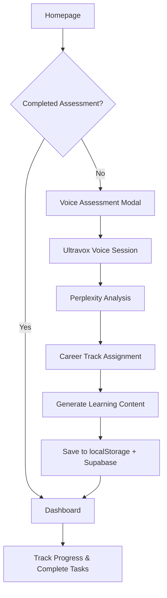
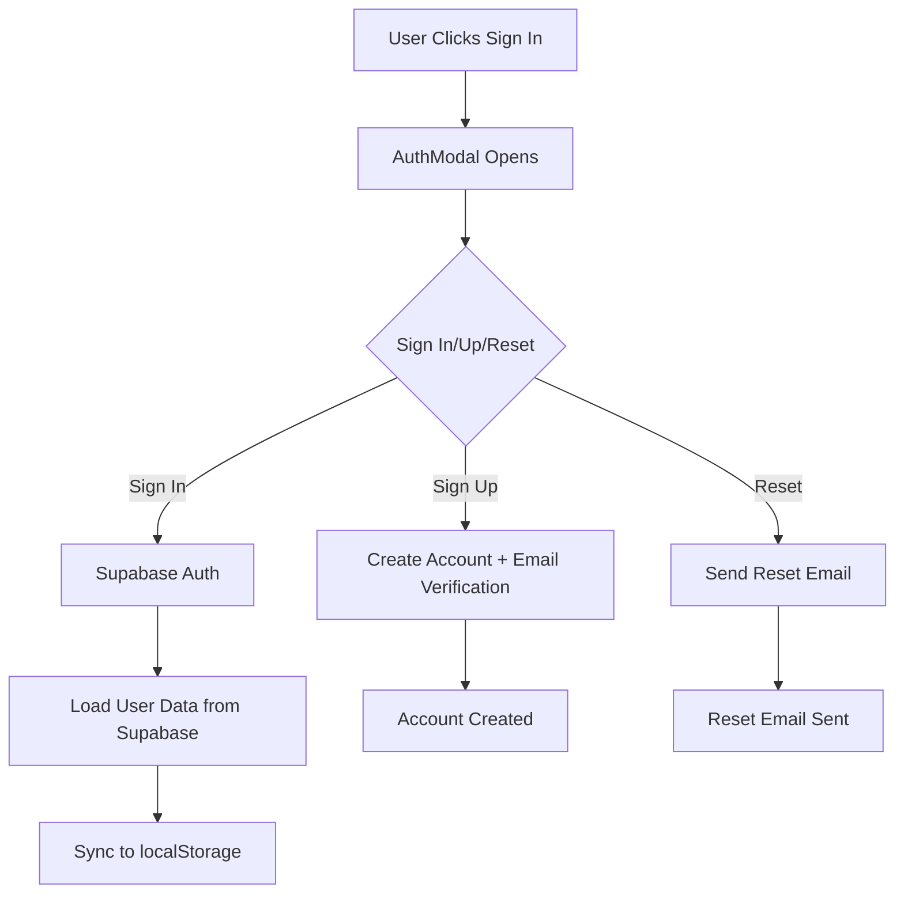

# AMA Career Platform - Technical Documentation

## 🏗️ Architecture Overview

The AMA Career Platform is a **Next.js 14** application that provides AI-powered career guidance through voice assessment. It uses a modern tech stack with TypeScript, Tailwind CSS, and integrates with multiple external services.

### Core Technologies
- **Frontend**: Next.js 14 (App Router), React 18, TypeScript
- **Styling**: Tailwind CSS with custom design system
- **Authentication**: Supabase Auth (email/password + social providers)
- **Database**: Supabase (PostgreSQL) with Row Level Security
- **Voice Processing**: Ultravox SDK (currently mocked for development)
- **AI Analysis**: Perplexity API for conversation analysis
- **State Management**: React Hooks + localStorage + Supabase sync
- **Deployment**: Vercel-ready with environment variable support

---

## 📁 Project Structure

```
src/
├── app/                          # Next.js App Router
│   ├── api/                     # API Routes (Server-side)
│   │   ├── analyze-conversation/ # Perplexity AI analysis
│   │   ├── generate-content/    # Career content generation
│   │   └── start-voice-session/ # Ultravox session initialization
│   ├── career-map/             # Career track selection page
│   ├── dashboard/              # User progress dashboard
│   ├── globals.css             # Global styles & Tailwind
│   ├── layout.tsx              # Root layout with navigation
│   └── page.tsx                # Homepage with assessment CTA
├── components/                  # React Components
│   ├── AuthModal.tsx           # Authentication modal
│   ├── Navigation.tsx          # Main navigation bar
│   └── VoiceCallModal.tsx      # Voice assessment interface
├── hooks/                      # Custom React Hooks
│   ├── useAuth.ts              # Supabase authentication
│   └── useUltravoxState.ts     # Dashboard unlock & track locking
├── lib/                        # External Service Clients
│   ├── perplexity-client.ts    # Perplexity API integration
│   ├── supabase-client.ts      # Supabase client configuration
│   └── ultravox-client.ts      # Ultravox SDK wrapper (mocked)
├── types/                      # TypeScript Definitions
│   └── index.ts                # All type definitions
└── utils/                      # Utility Functions
    └── api.ts                  # Data management & API calls
```

---

## 🔄 Application Flow

### 1. User Journey


### 2. Authentication Flow


---

## 🎯 Core Features

### Voice Assessment System
- **Trigger**: Homepage CTA button opens `VoiceCallModal`
- **Process**: 
  1. Calls `/api/start-voice-session` to get Ultravox session
  2. Creates mock Ultravox client (replace with real SDK in production)
  3. Simulates 3-second voice conversation
  4. Sends conversation data to `/api/analyze-conversation`
  5. Perplexity AI analyzes and returns career track match
  6. Generates career content via `/api/generate-content`
  7. Shows confetti animation and redirects to dashboard

### Career Track System
Three predefined tracks with different learning paths:
- **Game Design**: Game mechanics, level design, UX
- **Art Design**: Digital art, 3D modeling, animation
- **Content Creation**: Video production, social media, storytelling

### Progress Tracking
- **XP System**: Users earn XP by completing tasks
- **Levels**: Hierarchical learning progression
- **Task Types**: Video, Article, Project with different XP values
- **Unlocking**: Completing a level unlocks the next one

### Data Persistence
- **localStorage**: Primary storage for immediate access
- **Supabase**: Cloud backup for cross-device sync
- **Sync Strategy**: localStorage → Supabase on changes, Supabase → localStorage on login

---

## 🔧 API Endpoints

### POST `/api/start-voice-session`
**Purpose**: Initialize Ultravox voice session
**Request**: Empty POST body
**Response**: 
```json
{
  "sessionId": "session_1234567890_abc123",
  "token": "token_xyz789"
}
```
**Implementation**: Currently mocked, replace with actual Ultravox API call

### POST `/api/analyze-conversation`
**Purpose**: Analyze voice conversation using Perplexity AI
**Request**:
```json
{
  "raw": {
    "sessionId": "session_123",
    "transcript": "I'm interested in game development...",
    "duration": 180,
    "metadata": { ... }
  }
}
```
**Response**:
```json
{
  "track": "gameDesign",
  "reasoning": "User shows strong interest in interactive experiences...",
  "scores": {
    "gameDesign": 85,
    "artDesign": 60,
    "contentCreation": 45
  }
}
```

### GET `/api/generate-content?track=gameDesign`
**Purpose**: Generate career learning content for assigned track
**Parameters**: `track` (gameDesign|artDesign|contentCreation)
**Response**: Complete `CareerData` object with levels, tasks, and XP structure

---

## 🗄️ Data Models

### CareerData
```typescript
interface CareerData {
  targetRole: string;           // "Game Designer"
  selectedTrack: string;        // "gameDesign"
  totalXP: number;             // 1000
  currentXP: number;           // User's current XP
  currentLevel: number;        // Current level ID
  levels: Level[];             // Array of learning levels
}
```

### Level
```typescript
interface Level {
  id: number;                  // Level identifier
  title: string;               // "Game Design Fundamentals"
  xpRequired: number;          // XP needed to unlock
  isUnlocked: boolean;         // Can user access this level?
  isCompleted: boolean;        // Has user finished all tasks?
  tasks: Task[];               // Array of learning tasks
}
```

### Task
```typescript
interface Task {
  id: string;                  // Unique task ID
  title: string;               // "Introduction to Game Design"
  xp: number;                  // XP reward for completion
  isCompleted: boolean;        // Completion status
  type: 'video' | 'article' | 'project';
  description: string;         // Task description
  resources: string[];         // URLs to learning materials
}
```

---

## 🔐 Authentication & Security

### Supabase Authentication
- **Methods**: Email/password, social providers (configurable)
- **Session Management**: Automatic token refresh
- **User Profiles**: Stored in `user_profiles` table with RLS

### Row Level Security (RLS)
```sql
-- Users can only access their own data
CREATE POLICY "Users can view their own profile" 
    ON public.user_profiles FOR SELECT 
    USING (auth.uid() = user_id);
```

### Environment Variables
```bash
# Required for production
NEXT_PUBLIC_SUPABASE_URL=https://xyz.supabase.co
NEXT_PUBLIC_SUPABASE_ANON_KEY=your_anon_key
ULTRAVOX_API_KEY=your_ultravox_key
PPLX_API_KEY=your_perplexity_key
```

---

## 💾 State Management

### localStorage Keys
- `ama-call-completed`: Boolean flag for assessment completion
- `ama-assigned-track`: Selected career track (locked after assessment)
- `ama-career-data-{track}`: Career progress data per track

### React Hooks
- **useAuth**: Manages authentication state and Supabase sync
- **useDashboardUnlock**: Determines if user can access dashboard
- **useTrackLock**: Manages career track locking after assessment

### Hydration Safety
All hooks use `mounted` state to prevent SSR/client hydration mismatches:
```typescript
const [mounted, setMounted] = useState(false);
useEffect(() => setMounted(true), []);
if (!mounted) return <LoadingSpinner />;
```

---

## 🎨 UI/UX Design

### Design System
- **Primary Color**: `primary-600` (customizable in Tailwind config)
- **Typography**: Inter font family
- **Icons**: Lucide React icon library
- **Animations**: Tailwind transitions + canvas-confetti for celebrations

### Responsive Design
- **Mobile-first**: All components responsive with `md:` breakpoints
- **Navigation**: Collapsible mobile menu
- **Modals**: Full-screen on mobile, centered on desktop

### Accessibility
- **Focus Management**: Proper focus rings and keyboard navigation
- **ARIA Labels**: Screen reader support
- **Color Contrast**: Meets WCAG guidelines

---

## 🔌 External Integrations

### Ultravox SDK (Voice Processing)
**Current Status**: Mocked for development
**Production Setup**:
1. Install `ultravox-client` package
2. Replace mock client in `src/lib/ultravox-client.ts`
3. Configure API key in environment variables
4. Update session initialization logic

### Perplexity AI (Conversation Analysis)
**Model**: `pplx-70b-online`
**Prompt Engineering**: System prompt defines JSON response format
**Fallback**: Returns default `gameDesign` track if API fails
**Rate Limiting**: Handle API limits gracefully

### Supabase (Database & Auth)
**Database**: PostgreSQL with JSONB for flexible career data storage
**Real-time**: Can be extended with real-time subscriptions
**Storage**: Can add file storage for user uploads/portfolios

---

## 🚀 Deployment Guide

### Environment Setup
1. **Supabase Project**:
   - Create new project at supabase.com
   - Run `supabase-schema.sql` in SQL editor
   - Configure authentication providers
   - Get URL and anon key

2. **Perplexity API**:
   - Sign up at perplexity.ai
   - Generate API key
   - Add to environment variables

3. **Ultravox API** (when ready):
   - Sign up at ultravox.ai
   - Get API credentials
   - Replace mock implementation

### Vercel Deployment
```bash
# Install dependencies
pnpm install

# Build for production
pnpm build

# Deploy to Vercel
vercel --prod
```

### Environment Variables (Production)
Set in Vercel dashboard or deployment platform:
- `NEXT_PUBLIC_SUPABASE_URL`
- `NEXT_PUBLIC_SUPABASE_ANON_KEY`
- `ULTRAVOX_API_KEY`
- `PPLX_API_KEY`

---

## 🧪 Development Notes

### Mock Implementations
- **Ultravox Client**: Simulates 3-second voice session with mock data
- **Career Content**: Static data in `/api/generate-content`
- **Conversation Analysis**: Falls back to default track if Perplexity fails

### Testing Strategy
- **Unit Tests**: Add Jest + React Testing Library
- **E2E Tests**: Add Playwright for user flows
- **API Tests**: Test all endpoints with mock data

### Performance Optimizations
- **Code Splitting**: Next.js automatic code splitting
- **Image Optimization**: Use Next.js Image component
- **Caching**: Add Redis for API response caching
- **CDN**: Vercel Edge Network for global distribution

---

## 🔧 Customization Guide

### Adding New Career Tracks
1. Update `TrackType` in `src/types/index.ts`
2. Add track data in `src/app/api/generate-content/route.ts`
3. Update Perplexity prompt to include new track
4. Add track info in `src/app/career-map/page.tsx`

### Extending Learning Content
1. Modify `Level` and `Task` interfaces for new fields
2. Update career data generation logic
3. Enhance dashboard UI for new content types
4. Add progress tracking for new metrics

### Integrating Real Voice Processing
1. Replace mock Ultravox client with real SDK
2. Update session management logic
3. Handle real-time audio streaming
4. Add error handling for network issues

---

## 🐛 Common Issues & Solutions

### Hydration Mismatches
**Problem**: Server/client state differences
**Solution**: Use `mounted` state in all hooks that access localStorage

### Supabase URL Errors
**Problem**: Invalid or missing Supabase URL
**Solution**: Enhanced validation in `supabase-client.ts` with automatic `https://` prepending

### Authentication Persistence
**Problem**: User logged out on page refresh
**Solution**: Supabase automatically handles session persistence via cookies

### Mobile Navigation
**Problem**: Menu doesn't close on route change
**Solution**: Close mobile menu in navigation click handlers

---

## 📈 Future Enhancements

### Short Term
- [ ] Real Ultravox SDK integration
- [ ] Enhanced career content (videos, articles, projects)
- [ ] User profile customization
- [ ] Progress analytics dashboard

### Medium Term
- [ ] Social features (sharing progress, leaderboards)
- [ ] Mentor matching system
- [ ] Portfolio builder integration
- [ ] Mobile app (React Native)

### Long Term
- [ ] AI-powered personalized learning paths
- [ ] Industry partnerships for job placement
- [ ] Certification system
- [ ] Multi-language support

---

## 👥 Team Onboarding

### Prerequisites
- Node.js 18+ and pnpm
- Basic React/Next.js knowledge
- TypeScript familiarity
- Supabase account for database access

### Getting Started
1. Clone repository and install dependencies
2. Copy `env.example` to `.env.local`
3. Set up Supabase project and add credentials
4. Run `pnpm dev` to start development server
5. Test voice assessment flow (uses mock data)

### Code Style
- Use TypeScript for all new code
- Follow existing component patterns
- Add proper error handling and loading states
- Write descriptive commit messages
- Test on mobile devices

---

This documentation provides a complete technical overview of the AMA Career Platform. For specific implementation details, refer to the individual source files and their inline comments.
